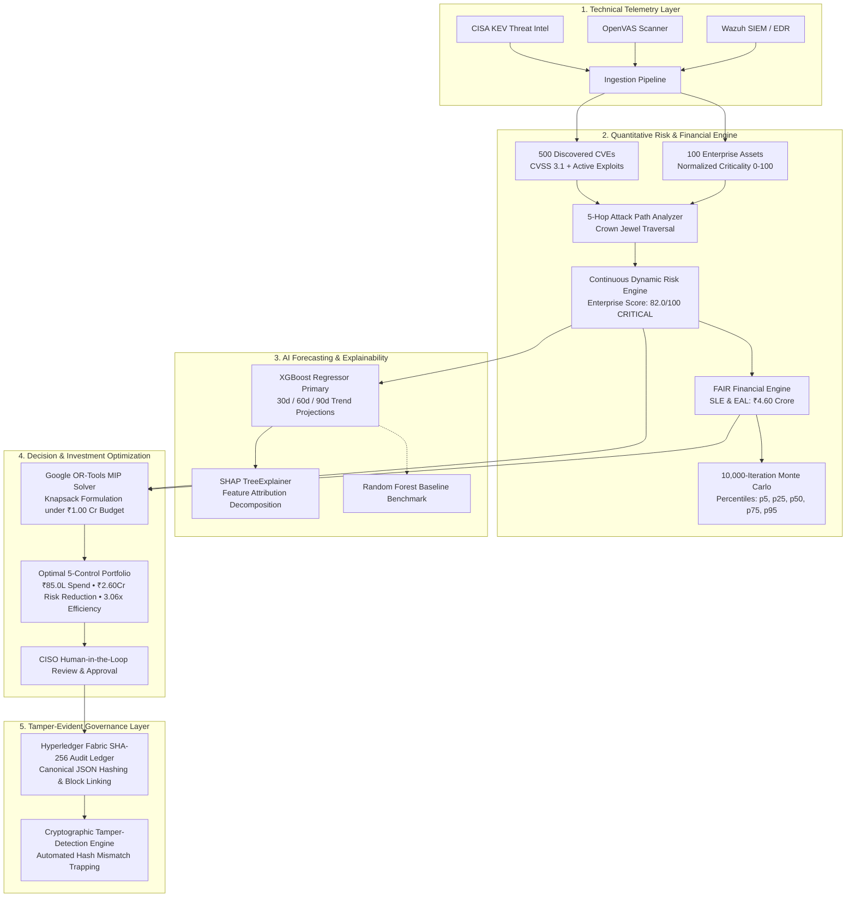

# QUANTUM RISK AI: AI-Powered Continuous Cyber Risk Quantification & Investment Optimization Platform

[](#)
[](#)
[](#)
[](#)
[](#)
[](#)
[](#)
[](#)

---

## 1. Executive Problem & Solution

### The Core Enterprise Dilemma
Modern enterprises and CISOs face an urgent question that qualitative 5×5 heatmaps and static risk registries cannot answer:
> **"How can an organization use its limited cybersecurity budget to achieve the MAXIMUM MODELED REDUCTION in financial cyber risk?"**

### The Solution: Quantum Risk AI
**Quantum Risk AI** is a software-only, enterprise-grade decision-intelligence platform that continuously bridges the gap between technical vulnerability telemetry, quantitative financial loss modeling (FAIR), explainable AI risk forecasting (XGBoost + SHAP), mathematically proven security investment optimization (Google OR-Tools MIP), and tamper-evident blockchain audit notarization (Hyperledger Fabric canonical SHA-256 ledger).

---

## 2. Platform Architecture



---

## 3. Mathematical & Optimization Formulations

### A. Expected Annual Loss (EAL)
$$\text{EAL} = \text{SLE} \times \text{ARO}$$
Where:
- $\text{SLE}$ (Single Loss Expectancy) $= \text{Asset Value} \times \text{Exposure Factor} + \text{Downtime Loss} + \text{IR Forensics} + \text{Data Recovery} + \text{Regulatory Penalties}$
- $\text{ARO}$ (Annualized Rate of Occurrence) is dynamically calculated from CVSS severity, asset exposure surface, and active CISA KEV exploitation multipliers.

### B. Google OR-Tools Mixed-Integer Knapsack Optimization
$$\max \sum_{i=1}^{N} \Delta \text{Risk}_i \cdot x_i$$
Subject to:
$$\sum_{i=1}^{N} \text{Cost}_i \cdot x_i \le \text{Cybersecurity Budget}$$
$$x_j \le x_k \quad \forall (j, k) \in \text{Prerequisite DAG}$$
$$x_i \in \{0, 1\} \quad \forall i \in \{1, \dots, N\}$$

---

## 4. SIH 18-Step Interactive Demonstration Script

The platform includes a built-in **SIH Master Demonstration Controller Bar** at the top of every dashboard page:

| Step # | Event / Milestone | Modeled EAL | Action & Key Observation |
|---|---|---|---|
| **1** | Baseline Cyber Risk | **₹2.80 Crore** | Enterprise steady state with 100 assets and standard telemetry. |
| **2** | Critical Log4j CVE-2021-44228 Discovered | **₹3.50 Crore** | Vulnerability scanner flags CVSS 10.0 RCE on perimeter web tier. |
| **3** | Active Threat Exploitation Detected (CISA KEV) | **₹4.60 Crore** | FIN7 / LockBit campaigns weaponize Log4j; enterprise risk score surges to 82.0/100 (CRITICAL). |
| **4** | Attack Path Graph Traversal | **₹72.0 Lakh** | Engine maps 5-hop path: Internet $\rightarrow$ WAF $\rightarrow$ Web Server $\rightarrow$ API Gateway $\rightarrow$ IAM $\rightarrow$ **Core Payment DB Cluster**. |
| **5** | FAIR Financial Quantification | **₹4.60 Crore** | Quantifies operational downtime (₹22.0L), IR response (₹10.0L), recovery (₹13.8L), and DPDP legal fines (₹18.4L). |
| **6** | XGBoost AI Risk Forecast | **₹95.0 Lakh (30d)** | Machine learning predicts 32% risk surge over 30 days without intervention. |
| **7** | Explainable AI (SHAP Decomposition) | **32% / 27% / 18%** | SHAP proves that active exploits (32%), asset criticality (27%), and internet exposure (18%) drive risk surge. |
| **8** | CISO Sets ₹1.00 Crore Budget | **₹1.00 Crore Cap** | Formal boundary constraint entered into the optimization engine. |
| **9** | Google OR-Tools MIP Solver Solves | **Sub-50ms Execution** | Mixed-integer knapsack evaluates 20 controls and prerequisite dependencies. |
| **10** | Optimal Allocation Selected | **₹85.0 Lakh Spend** | Optimal 5-control portfolio selected with ₹15.0L contingency buffer. |
| **11** | Modeled Post-Investment Risk Calculated | **₹2.00 Crore** | Risk drops from ₹4.60 Crore down to ₹2.00 Crore. |
| **12** | Modeled Risk Reduction & Efficiency Metric | **₹2.60 Cr (3.06x)** | CISO achieves ₹2.60 Crore in modeled risk reduction with a 3.06x efficiency multiplier. |
| **13** | CISO Human Review | **Audit Prepared** | CISO evaluates control portfolio and attack path interception points. |
| **14** | CISO Formal Approval | **Signed & Approved** | One-click cryptographic approval submitted. |
| **15** | Blockchain Audit Notarization | **Block #2 Notarized** | Canonical SHA-256 hash snapshot written to Hyperledger Fabric channel. |
| **16** | Automated Remediation Execution | **Controls Active** | Virtual patching and micro-segmentation deployed. |
| **17** | Dynamic Risk Engine Recalculation | **₹2.00 Crore** | Live telemetry updates risk score from 82.0 down to 45.0/100. |
| **18** | Auditor Verification & Tamper Detection | **100% Tamper-Free** | Auditor runs cryptographic verification; launches Tamper Sandbox to witness real-time hash mismatch detection. |

---

## 5. Quickstart & Installation

### Prerequisites
- **Python 3.11+**
- **Node.js 20+ & NPM**

### 1-Click Launch (Windows PowerShell)
```powershell
.\run_demo.ps1
```
*This runs automated pytest suites, starts the FastAPI backend on `http://localhost:8000`, and starts the React dashboard on `http://localhost:5173`.*

### Manual Startup

#### Backend
```powershell
cd d:\SIH\backend
.\.venv\Scripts\python.exe -m uvicorn app.main:app --host 0.0.0.0 --port 8000 --reload
```
- Interactive Swagger UI: `http://localhost:8000/docs`
- ReDoc UI: `http://localhost:8000/redoc`

#### Frontend
```powershell
cd d:\SIH\frontend
npm run dev
```
- Dashboard UI: `http://localhost:5173`

---

## 6. Docker Deployment

```bash
docker-compose up --build
```
- Frontend: `http://localhost`
- Backend API: `http://localhost:8000`

---

## 7. Role-Based Access Controls (Pre-Configured)

| Role | Default User | Capabilities |
|---|---|---|
| **CISO** | `ciso@abcbank.com` | Enterprise risk governance, OR-Tools optimization, cryptographic investment approvals |
| **Security Analyst** | `analyst@abcbank.com` | Vulnerability queue triage, CISA KEV exploit analysis, telemetry ingestion |
| **Risk Analyst** | `risk@abcbank.com` | FAIR loss parameters, Monte Carlo distribution modeling, digital twin simulations |
| **Executive / Board** | `executive@abcbank.com` | High-level risk overview, budget utilization, downloadable board PDF reports |
| **Auditor** | `auditor@abcbank.com` | Hyperledger Fabric block inspection, cryptographic hash verification, tamper testing |
| **Administrator** | `admin@abcbank.com` | System configuration, database backups, organization profiles |

*All roles can be instantly switched at any time using the header role dropdown in the top navbar.*

---

## 8. Master Test Suite Verification

Run the full automated test suite covering all platform components:
```powershell
d:\SIH\backend\.venv\Scripts\pytest.exe d:\SIH\backend\tests -v
```
**Test Results:**
- `test_risk_engine.py`: Dynamic continuous risk scoring & asset criticality normalization **[PASSED]**
- `test_financial_and_opt.py`: FAIR EAL, 10k Monte Carlo, Google OR-Tools budget enforcement, and Blockchain SHA-256 tamper detection **[PASSED]**
- `test_api_endpoints.py`: All 15 REST endpoints, JWT authentication, and SIH 18-step demo execution **[PASSED]**

---
*Developed for Smart India Hackathon (SIH 2026).*
